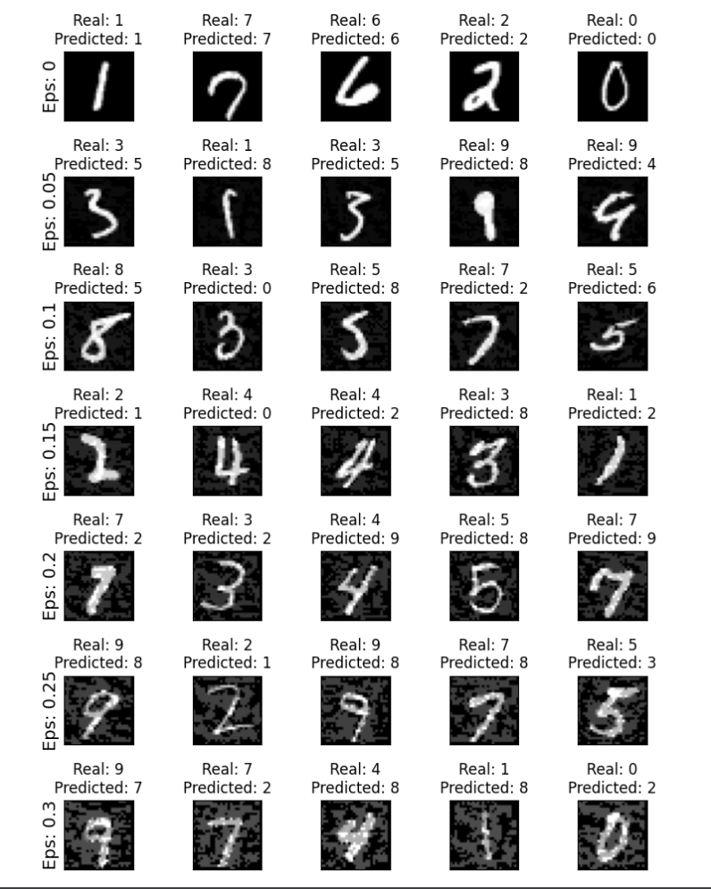

# Laboratory work 1

This is implementation of Adversarial attack on MNIST digit classfifier
### Results

### How to Run
Run `main` func in `emulator.py`. By default you will run it will use pregenerated MNIST classifier.
  