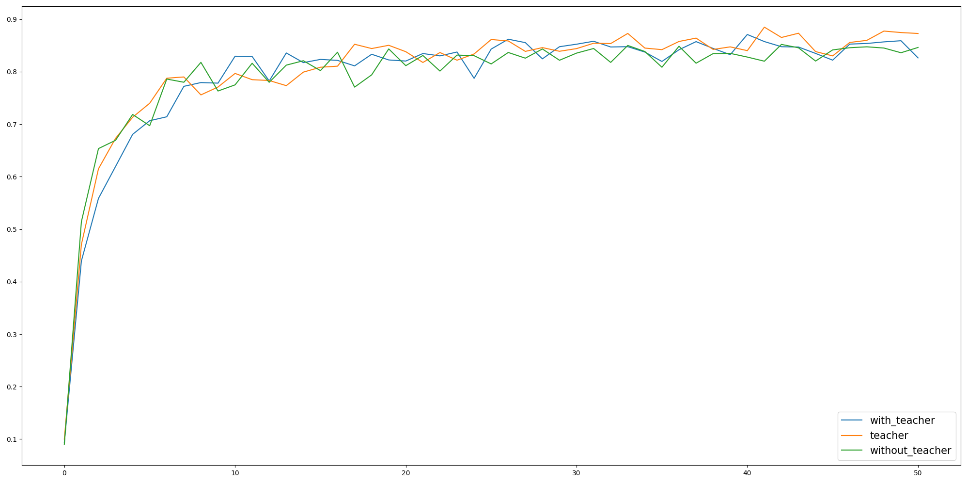

# Laboratory work 3

This is example of knowledge-distillation for cifar-10 classifier 
### Results

* without_teacher - model with 2 layers, without using distillation
* with_teacher - model with 2 layers, with distillation
* teacher - model with 5 layers, used as teacher for sitillation
### How to Run
Run `main` func in `distillation.py`. By default you will run it with two layers, 
on 100 epochs and without teacher. Approximate execution time - 3 hours on average laptop
To create diagram, run `main` func in `printer.py`. Note that names of saved files are hardcoded into the code. 
 
Note: when running on Mac os you can encounter several certificate failure exception, due 
to usage of pregenerated CNN. In this case run certificate.py  