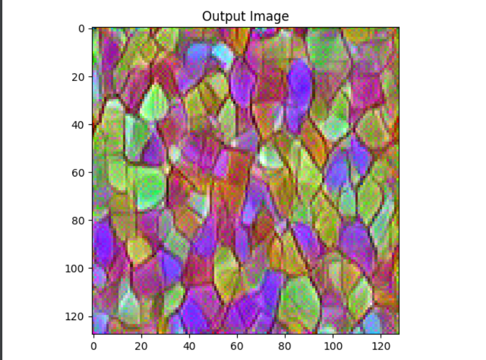
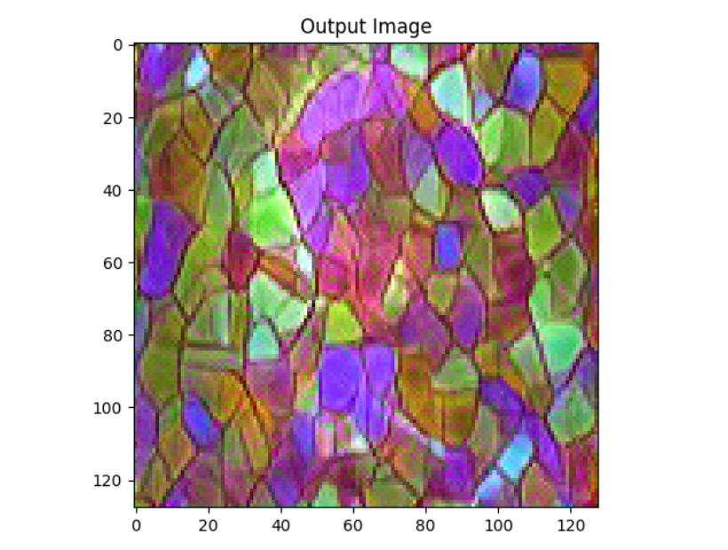
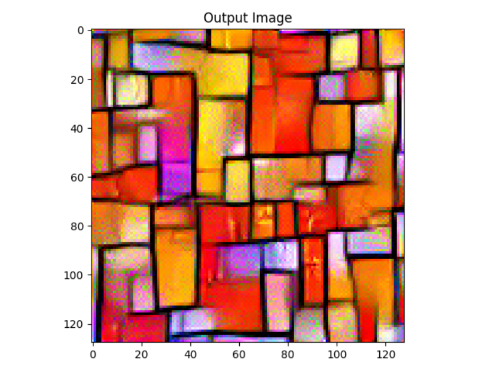
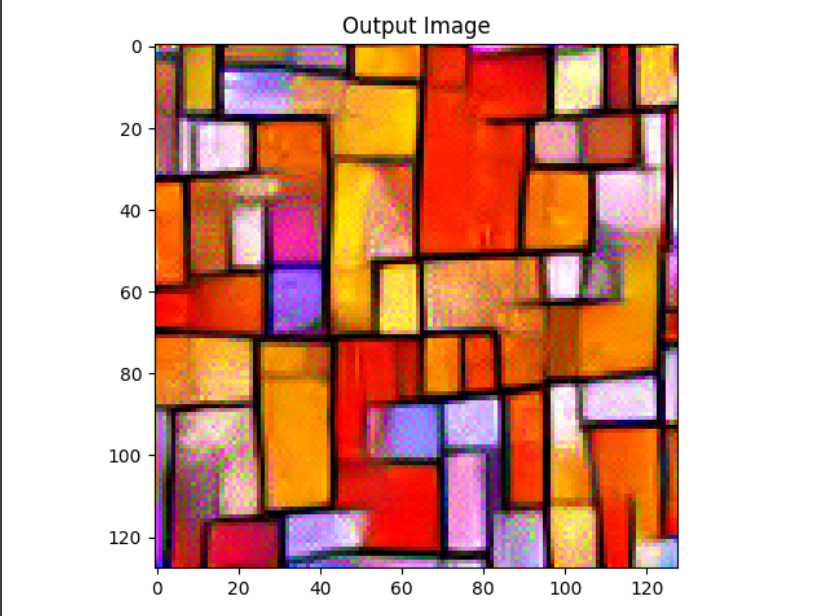

# Laboratory work 2

This is style-transferer Neural Network, based on [this article](https://arxiv.org/abs/1508.06576)
### Results
In this repository in `data` folder there are [source image](data/source.jpeg) and two filter images, which are
basically two different types of stained glass textures.
The results for two different styles can be seen below: 

Filter 1 with 300 steps of style-transferer

Filter 1 with 600 steps of style-transferer

Filter 2 with 300 steps of style-transferer

Filter 2 with 600 steps of style-transferer

### How to Run
Run `main` func in `transfer.py`. By default you will run it on files 
from `data` folder named [source.jpeg](data/source.jpeg) and [filter.png](data/filter.png)
In order to run your files, you should add your own files to `data` folder with the same names (or change code in transfer.py). 
By default it will run transferer on 600 steps

Note: when running on Mac os you can encounter several certificate failure exception, due 
to usage of pregenerated CNN. In this case run certificate.py  